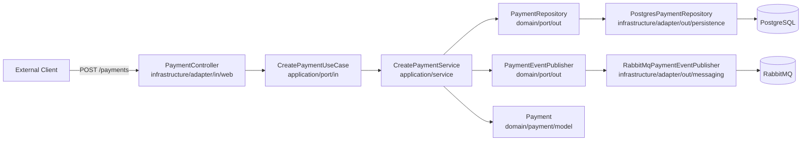

# Application Structure

This document reflects the structure currently implemented in the repository.

## Current Scope

The codebase currently contains one implemented service: `payment-api`.

The root `README.md` describes a larger event-driven platform with `payment-processor`, `ledger-service`, and `notification-service`, but those services are not present in this repository yet.

## High-Level Drawing

```text
+------------------+         HTTP POST /payments         +----------------------+
| External Client  | ---------------------------------> | PaymentController    |
+------------------+                                    | infrastructure/adapter/in/web |
                                                          +----------+-----------+
                                                                     |
                                                                     v
                                                          +----------------------+
                                                          | CreatePaymentUseCase |
                                                          | application/port/in  |
                                                          +----------+-----------+
                                                                     |
                                                                     v
                                                          +----------------------+
                                                          | CreatePaymentService |
                                                          | application/service  |
                                                          +----+------------+----+
                                                               |            |
                                  find/save Payment            |            | publish event
                                                               |            |
                                                               v            v
                                           +----------------------+   +------------------------+
                                           | PaymentRepository    |   | PaymentEventPublisher  |
                                           | domain/port/out      |   | domain/port/out        |
                                           +----------+-----------+   +-----------+------------+
                                                      |                           |
                                                      v                           v
                                 +--------------------------------+   +-----------------------------+
                                 | PostgresPaymentRepository      |   | RabbitMqPaymentEventPublisher|
                                 | infrastructure/adapter/out/persistence |   | infrastructure/adapter/out/messaging |
                                 +---------------+----------------+   +-------------+---------------+
                                                 |                                  |
                                                 v                                  v
                                 +------------------------------+      +----------------------------+
                                 | Spring Data JPA + PostgreSQL |      | RabbitMQ exchange + queue |
                                 +------------------------------+      +----------------------------+

Core domain entity used across the flow:

+---------------------------------------------------------------+
| Payment                                                      |
| id, externalReference, amount, currency, payerId, receiverId |
| idempotencyKey, status, version                              |
+---------------------------------------------------------------+
```

## Package Design

```text
payment-api/src/main/java/io/github/paymentapi
|
+-- PaymentApiApplication
+-- application
|   +-- port/in
|   |   +-- CreatePaymentUseCase
|   +-- service
|   |   +-- CreatePaymentService
|   +-- usecase
|       +-- CreatePaymentCommand
|       +-- CreatePaymentResult
+-- domain
|   +-- payment
|       +-- model
|       |   +-- Payment
|       |   +-- PaymentStatus
|       +-- port/out
|           +-- PaymentRepository
|           +-- PaymentEventPublisher
+-- infrastructure
    +-- config
    |   +-- Spring and adapter wiring
    +-- adapter
        +-- in
        |   +-- web
        |       +-- PaymentController
        |       +-- CreatePaymentRequest
        |       +-- CreatePaymentResponse
        |       +-- ApiExceptionHandler
        +-- out
            +-- persistence
            |   +-- PostgresPaymentRepository
            |   +-- SpringDataPaymentRepository
            |   +-- PaymentJpaEntity
            |   +-- PaymentEntityMapper
            +-- messaging
                +-- RabbitMqPaymentEventPublisher
                +-- PaymentCreatedEvent
                +-- PaymentMessagingProperties
```

## Request Flow

```text
1. Client sends POST /payments with Idempotency-Key
2. PaymentController validates input and builds CreatePaymentCommand
3. CreatePaymentService checks PaymentRepository by idempotency key
4. If payment already exists, the existing result is returned
5. If not, a new Payment is created with status PENDING
6. PostgresPaymentRepository persists the payment in PostgreSQL
7. RabbitMqPaymentEventPublisher publishes the payment-created event
8. API returns CREATED for new payment or OK for an idempotent retry
```

## Mermaid Diagram


